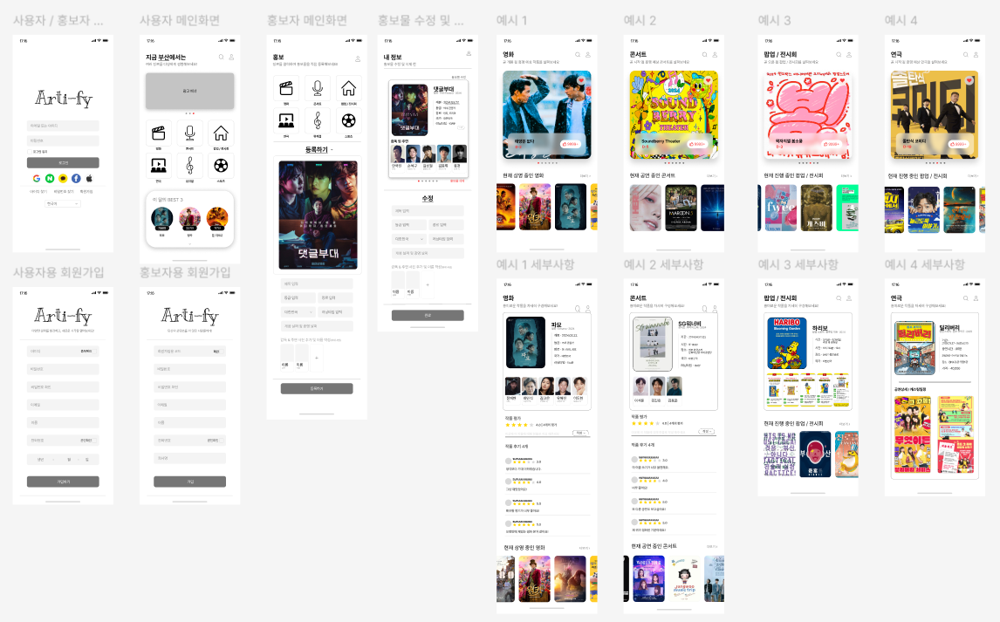
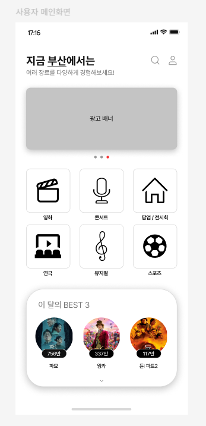
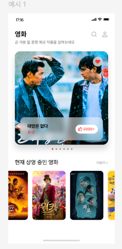
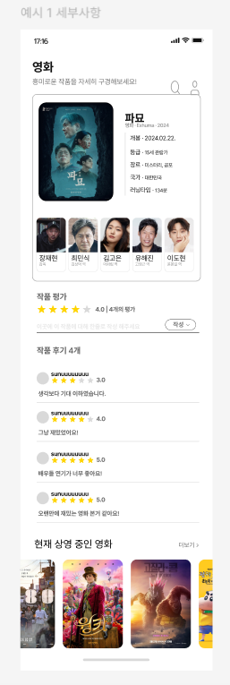

# 🎨 Arti-fy - 문화 콘텐츠 리뷰 플랫폼



> **Arti-fy**는 다양한 문화 콘텐츠(전시, 공연, 영화, 스포츠 등)를 탐색하고  
> 사용자들이 해당 콘텐츠에 리뷰와 댓글을 남길 수 있는 **문화 통합 앱**입니다.

---

## 📌 기획 의도

현대인들은 수많은 문화 콘텐츠 속에서 **나에게 맞는 문화 생활을 찾기 어렵습니다.**  
Arti-fy는 전시, 공연, 영화, 스포츠 등 다양한 분야의 정보를 제공하고  
직접 체험한 사용자들의 리뷰와 댓글을 통해 **믿을 수 있는 문화 선택 가이드**가 됩니다.

---

## 🖼️ Figma 설계 캡처

> UI/UX는 Figma를 통해 직접 설계하였습니다. 아래는 일부 주요 화면입니다:

### 🎬 메인 탐색 화면


### 📄 상세 콘텐츠 정보


### 📝 리뷰 및 댓글 화면


---

## 🛠️ 사용 기술 스택

| 영역        | 기술                                       |
|-------------|--------------------------------------------|
| **플랫폼**   | Android (Java or Kotlin)                   |
| **DB 저장**  | SQLite (내장 DB), 또는 Firebase 예정        |
| **디자인**   | Figma (UI/UX 설계)                          |
| **기타**     | 알림 기능, RecyclerView, Intent 처리 등     |

---

## 🗓️ 개발 로드맵

| 주차 | 내용 |
|------|------|
| 1주차 | 기획 및 Figma UI 설계 |
| 2주차 | Android Studio 세팅 및 기본 UI 개발 |
| 3주차 | 문화 콘텐츠 상세/리스트 구현 및 데이터 구조 설계 |
| 4주차 | 리뷰 및 댓글 기능 구현 (SQLite 연동) |
| 5주차 | UI 개선 + 알림 기능 + 테스트 및 마무리 |

---

## 🙋 기대 효과

- 문화 콘텐츠를 쉽고 빠르게 탐색할 수 있는 **사용자 맞춤형 플랫폼**  
- 실제 이용자들의 리뷰를 통해 **신뢰도 높은 문화 소비 판단 가능**  
- 기획부터 앱 구현까지 **모든 과정을 직접 수행한 모바일 포트폴리오 완성**

---

## 📁 폴더 구조 (예정)

```
arti-fy/
├── app/
│ ├── java/com/example/artify/
│ │ ├── MainActivity.java
│ │ ├── DetailActivity.java
│ │ └── ReviewActivity.java
│ └── res/
│ ├── layout/
│ ├── drawable/
│ └── values/
├── images/
│ ├── figma-preview.png
│ ├── figma-main.png
│ ├── figma-detail.png
│ └── figma-review.png
└── README.md
```
---

## 🔗 참고 링크

- 👉 [Figma 전체 디자인 보기](https://www.figma.com/design/7Kopfdzo9xZju8a0D6fDNk/%EB%AA%A8%EB%B0%94%EC%9D%BC%EC%9B%B9%EA%B0%9C%EB%B0%9C-%EB%94%94%EC%9E%90%EC%9D%B8?node-id=0-1&p=f&t=TgTzOdRZgVdRhY6s)
- 개발자: 임선우  
- 프로젝트 유형: 대학 앱 개발 포트폴리오 / 문화 정보 탐색 앱
